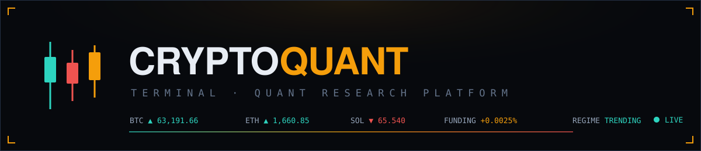
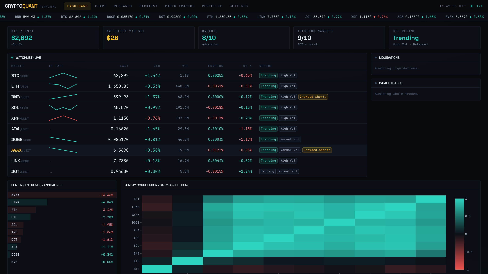
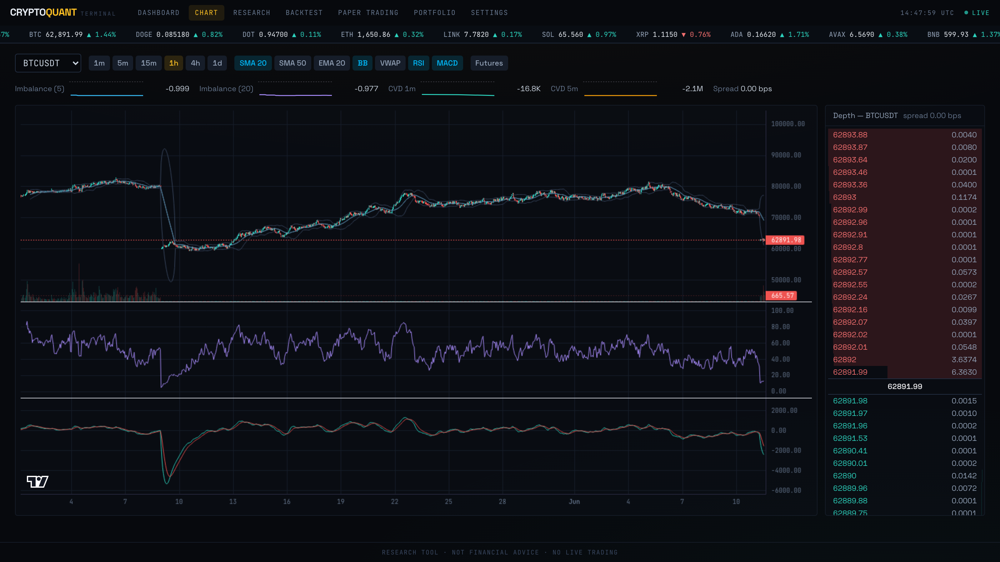
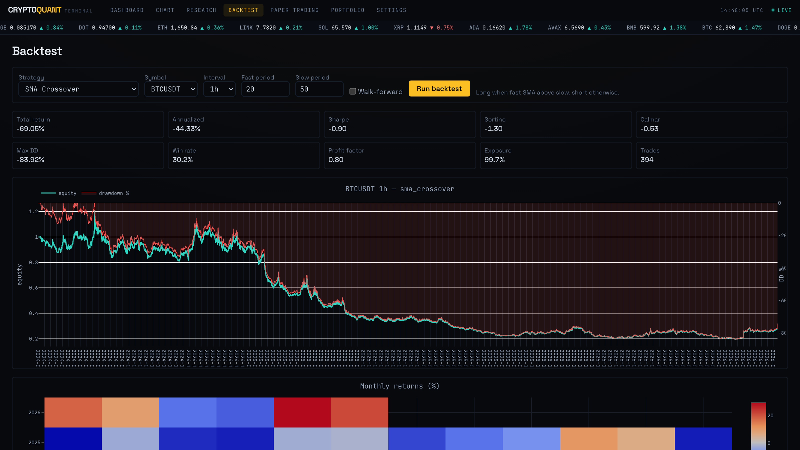
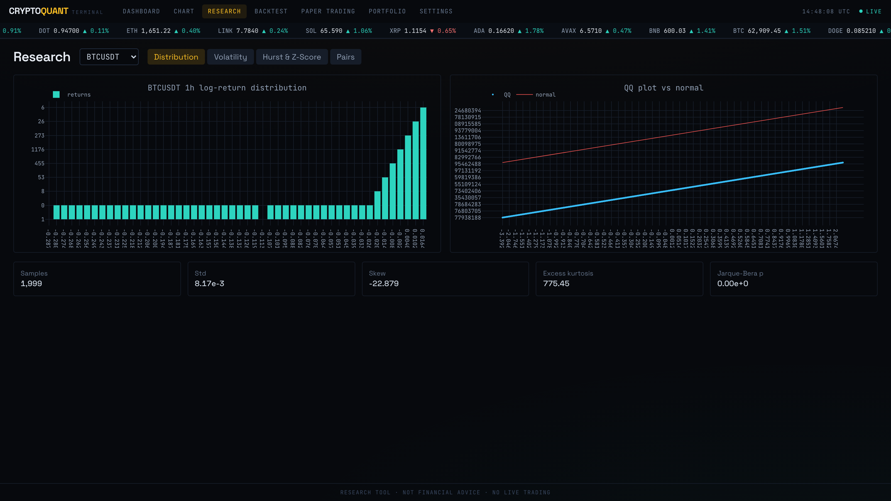
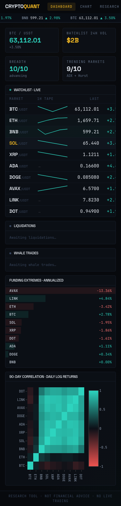
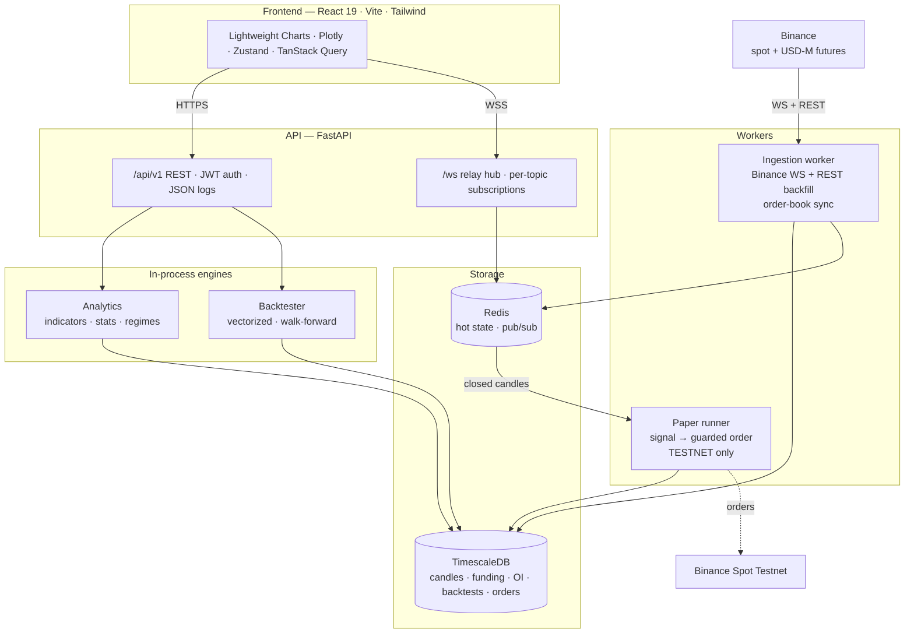

<div align="center">



**A self-hosted crypto quant research terminal powered by the Binance API.**
Live market data · technical & statistical analytics · vectorized backtesting · testnet paper trading — in a Bloomberg-style mission-control UI.

[](https://github.com/steliosk98/Binance-QuantTradingDashboard/actions/workflows/ci.yml)




</div>

> **Research tool. Not financial advice. There is no live-money trading mode — order execution targets Binance Spot Testnet only, by design.**

---

## Highlights

- 📡 **Live everything** — Binance WebSocket ingestion with auto-reconnect, order-book sync (snapshot + diff, full resync on gaps), sub-second chart ticks, streaming ticker tape, liquidation & whale feeds
- 🗄️ **Time-series storage done right** — TimescaleDB hypertables, idempotent gap-repairing backfill (2 years of candles, exact to the bar), compression & retention policies
- 📈 **A real analytics engine** — Wilder-exact RSI/ATR/ADX, MACD, Bollinger, VWAP, Ichimoku, 3 realized-vol estimators, Hurst exponent, ADF & Engle-Granger cointegration, order-book imbalance + CVD, per-symbol **market regime classification**
- ⚡ **Vectorized backtesting** — 6 built-in strategies with auto-generated parameter forms, fees + slippage, full metric suite, **walk-forward optimization with in-sample vs out-of-sample shown side by side** (2 years of hourly candles in <1s)
- 🤖 **Paper trading with guardrails** — strategy instances run live against closed candles on Binance Testnet (or internal sim fills), with max-position & daily-loss guards and a kill switch that halts within one evaluation cycle
- 🔐 **Single-user auth & key custody** — argon2 + JWT on every route, Binance keys Fernet-encrypted at rest and never returned to the client, read-only portfolio view
- 🖥️ **Terminal-grade UI** — dark mission-control design, JetBrains Mono tabular numerals, price-flash animations, live sparklines, `prefers-reduced-motion` support

## Screenshots

| Chart — indicators, RSI/MACD panes, live order book | Backtest — equity, drawdown, monthly heatmap |
| :--: | :--: |
|  |  |
| **Research — distributions, QQ, volatility, cointegration** | **Mission control on mobile** |
|  |  |

## Architecture



## Quick start

Self-host the full stack in about 10 minutes — public Binance market data needs **no API key**.

```bash
git clone https://github.com/steliosk98/Binance-QuantTradingDashboard.git
cd Binance-QuantTradingDashboard
docker compose up --build        # TimescaleDB, Redis, API, WS worker, paper runner, frontend

# in another shell — load 2 years of history for the 10-symbol watchlist:
docker compose exec backend alembic upgrade head
docker compose exec backend python -m app.ingestion.backfill
```

| | |
|---|---|
| 🖥️ Terminal | http://localhost:5173 — dev password `cryptoquant-dev` |
| 📚 API docs | http://localhost:8000/docs |
| 🚀 Cloud deploy | [docs/DEPLOY.md](docs/DEPLOY.md) — Railway (EU region) + Fly.io guides |

### Local development

```bash
# Backend (uv · ruff · mypy --strict · pytest)
cd backend && uv sync
uv run uvicorn app.main:app --reload
uv run pytest

# Frontend (pnpm · eslint · tsc · vitest · playwright)
cd frontend && pnpm install
pnpm dev
pnpm test && pnpm run e2e
```

## What's inside

### Market data
Rate-limited async Binance client (honors `X-MBX-USED-WEIGHT-1M`, backs off at 80%, retries 429/418 with `Retry-After`). Backfill is **gap-detection-driven**: it diffs the expected candle grid against the DB and fetches only what's missing, so re-runs are no-ops and holes self-repair. The WS worker streams klines for 6 intervals × 10 symbols, aggTrades, tickers, mark prices and liquidations, and maintains local order books using Binance's documented sync algorithm — any sequence gap triggers a full resync, never a patch.

### Analytics
Everything is computed on demand and cached in Redis, keyed by the last closed candle, so caches invalidate naturally. Indicators match TradingView (Wilder-seeded RMA, golden-tested against canonical fixtures). The statistical workbench covers return distributions (skew/kurtosis/Jarque-Bera/QQ), close-to-close / Parkinson / Garman-Klass volatility, rolling Hurst, z-scores, ADF and pairs cointegration. A composite **regime classifier** (ADX + Hurst + vol percentile + funding extremity) labels every market, e.g. `Trending · High Vol · Crowded Shorts`.

### Backtesting
Hand-rolled vectorized engine — positions decided on a bar's close take effect the next bar (no look-ahead, proven by test), costs charged on turnover. Strategies declare parameter schemas, so the UI renders their forms and the walk-forward optimizer grid-searches them automatically. Metrics: total/annualized return, Sharpe, Sortino, Calmar, max drawdown, win rate, profit factor, exposure, turnover.

### Paper trading
A runner subscribes to closed candles and evaluates every running strategy instance: signal → max-position clamp → market order on **testnet.binance.vision** (signed, server-time-synced) or internal sim fills when no keys are configured. Daily-loss guard halts an instance for the day; the kill switch is honored within one evaluation cycle; state persists in Postgres so restarts resume cleanly.

## Tech stack

| Layer | Choice |
|---|---|
| Backend | Python 3.12 · FastAPI · SQLAlchemy 2 (async) · pandas/numpy/scipy/statsmodels · APScheduler |
| Storage | PostgreSQL 16 + TimescaleDB (hypertables, compression) · Redis 7 (hot state, pub/sub) |
| Frontend | React 19 · TypeScript · Vite · Tailwind v4 · TradingView Lightweight Charts · Plotly · Zustand · TanStack Query |
| Quality | ruff · mypy --strict · pytest (vs real TimescaleDB+Redis) · eslint · vitest · Playwright E2E · gitleaks |
| Ops | Docker Compose · GitHub Actions · multi-stage non-root prod images · structured JSON logs with request IDs |

**260+ automated checks** run on every push: 124 backend tests, 33 frontend tests, 5 full-stack E2E tests (hermetic — synthetic data, no exchange dependency), plus lint/type/secret gates.

## Configuration

Copy `.env.example` to `.env`. Everything degrades gracefully when optional keys are absent.

| Variable | Required | Purpose |
|---|:--:|---|
| `DATABASE_URL` | ✅ | `postgresql+asyncpg://…` (TimescaleDB) |
| `REDIS_URL` | ✅ | hot cache + pub/sub |
| `TRADING_MODE` | ✅ | must be `testnet` — no other value exists |
| `SECRET_KEY` | auth | JWT signing + Fernet key derivation |
| `APP_PASSWORD_HASH` | auth | argon2 hash of the single-user password¹ |
| `CORS_ORIGINS` | prod | allowed frontend origin(s) |
| `WATCHLIST` | — | defaults to ten majors |
| `BINANCE_TESTNET_API_KEY/SECRET` | — | real testnet fills (else simulated) |
| `WHALE_THRESHOLD_USD` | — | whale feed threshold (default 250k) |
| `JSON_LOGS` | prod | structured logs with request IDs |
| `SENTRY_DSN` | — | error reporting |

¹ Generate with `uv run python -c "from app.core.security import hash_password; print(hash_password('yourpw'))"`

## Security model

Single-tenant by design. Argon2 + 24h JWTs protect every route and the WebSocket; CORS is locked to the frontend origin; Binance keys are Fernet-encrypted at rest, never returned to clients, and leak-tested in CI; the trading path is hard-gated to testnet. Before exposing an instance to the public internet, read the hardening notes in [BUILD_LOG.md](BUILD_LOG.md) — most importantly: always set `SECRET_KEY`/`APP_PASSWORD_HASH` (auth is off without them) and put the API behind TLS.

## Project log

The entire platform was built stage-by-stage with acceptance criteria verified at each step — [BUILD_LOG.md](BUILD_LOG.md) is the full engineering journal, including bugs found en route (Binance pagination quirks, dead array streams in combined WS URLs, and more).

## License

[MIT](LICENSE) — do whatever you like, no warranty.

<div align="center">
<sub>Research tool · Not financial advice · No live trading</sub>
</div>
